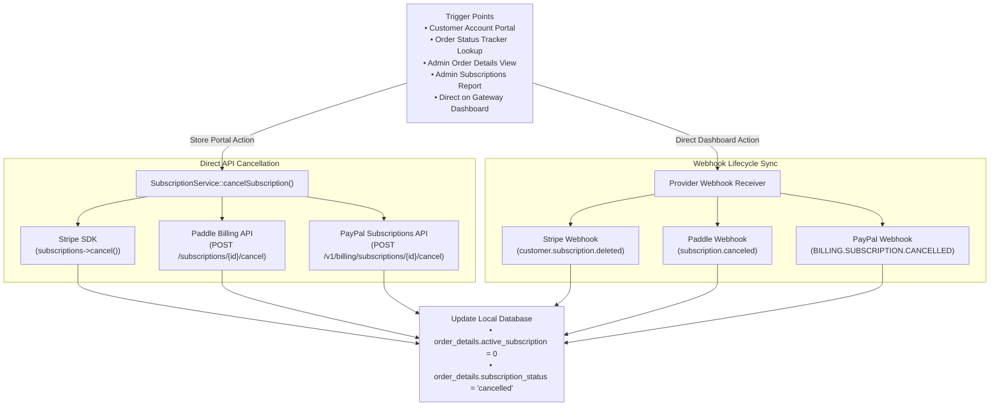

Any product variant in Site Store Pro can be configured as a recurring subscription by linking it to a Stripe, Paddle, or PayPal Plan/Price ID, or by enabling automatic Stripe/Paddle/PayPal on-the-fly plan creation. This document covers how subscription variants are detected, the mixed-cart policy, checkout routing, line-item tracking, database schema, cancellation mechanics, and the webhook events that drive automated subscription lifecycle management.

---

## 1. Overview

Subscription billing in Site Store Pro is configured at the **variant level**. Any product variant can be turned into a recurring subscription by linking it to a gateway Price/Plan ID or by letting the system automatically generate the subscription item and pricing on-the-fly.


---

## 2. How a Variant Becomes a Subscription

A variant is treated as a subscription when any gateway Price/Plan ID is configured, when a recurring billing interval is defined, or when auto-creation is enabled:

```php
// Returns true if any gateway price ID is configured, interval set, or auto-creation enabled
public function isSubscriptionVariant(): bool
{
    return !empty($this->stripe_sandbox_price_id)
        || !empty($this->stripe_live_price_id)
        || (int) $this->create_new_stripe_product === 1
        || !empty($this->paddle_sandbox_price_id)
        || !empty($this->paddle_live_price_id)
        || !empty($this->paddle_interval)
        || !empty($this->paypal_sandbox_plan_id)
        || !empty($this->paypal_live_plan_id);
}
```

The cart and checkout router call `isSubscriptionVariant()` on every item in the cart to determine single-intent routing and enforce the single/mixed-cart policies.

---

## 3. Admin Configuration by Gateway

Navigate to **Admin → Products → Edit Product → Prices & Variants → Open or Create a variant → Payment Processor IDs section**.

### 1. Stripe

<Tabs>
  <Tab title="Use Existing Price IDs">
    Enter the Price IDs you already created in the **Stripe Dashboard** (Products → Prices).

    | Field | Example Value |
    | :--- | :--- |
    | Stripe Sandbox Price ID | `price_1ABCtest…` |
    | Stripe Live Price ID | `price_1ABClive…` |

    Use this when you want full control over the Stripe product catalog.
  </Tab>
  <Tab title="Auto-Create Stripe Product">
    Enable **"Create new Stripe product"** to have the platform automatically create a Stripe Product and recurring Price at the time of the first checkout.

    | Option | Values |
    | :--- | :--- |
    | Billing Interval | `Monthly`, `Yearly`, or `Weekly` |
    | Free Trial | Toggle ON/OFF |
    | Trial Days | Number of days (integer) |

    Use this for rapid setup without pre-configuring anything in the Stripe Dashboard.
  </Tab>
</Tabs>

### 2. Paddle Billing (Automatic Non-Catalog Items & Catalog Price IDs)

Paddle Billing supports both pre-configured catalog Price IDs and **automatic non-catalog subscription item creation**:

<Tabs>
  <Tab title="Automatic Non-Catalog Subscription (Zero Setup)">
    **If no Paddle Price ID is entered**, the system **automatically creates the subscription item and recurring price on Paddle on-the-fly** during checkout.

    - **How it works**: The system constructs a dynamic non-catalog transaction item containing the variant title, price, currency, billing interval (`paddle_interval`: `month`, `year`, `week`, `day`), frequency multiplier (`paddle_frequency`), and trial terms.
    - **No Dashboard Setup Required**: You do not need to log into the Paddle Dashboard to pre-create products or price IDs.
    - **Discount & Currency Friendly**: Automatically handles item-level discounts, order-level coupons, and cross-border VAT adjustments dynamically on the recurring price.
  </Tab>
  <Tab title="Use Pre-Created Catalog Price IDs">
    If you prefer to link directly to catalog prices pre-configured in your **Paddle Dashboard**:

    | Field | Example Value |
    | :--- | :--- |
    | Paddle Sandbox Price ID | `pri_sandbox_01h…` |
    | Paddle Live Price ID | `pri_01h…` |

    If the cart price exactly matches the pre-created `paddle_price`, the system passes the catalog Price ID directly to Paddle.js.
  </Tab>
</Tabs>

### 3. PayPal Subscriptions

<Tabs>
  <Tab title="On-Demand Plan Generator (Recommended)">
    Configure the recurring terms in the variant editor and click **Generate Sandbox Plan** or **Generate Live Plan**:

    | Option | Description |
    | :--- | :--- |
    | Billing Interval | `Day`, `Week`, `Month`, `Year` |
    | Billing Frequency | Frequency multiplier (e.g. every `1` month, every `3` months) |
    | Total Billing Cycles | Total cycles (`0` for indefinite / until cancelled) |
    | Trial Period | Optional trial period with custom trial days and trial price ($0.00 or discounted) |

    The system creates the catalog product and recurring billing plan via the **PayPal Subscriptions REST API** and populates `paypal_sandbox_plan_id` or `paypal_live_plan_id` automatically.
  </Tab>
  <Tab title="Use Pre-Created PayPal Plan IDs">
    Enter Plan IDs created in the **PayPal Developer / Business Dashboard**:

    | Field | Example Value |
    | :--- | :--- |
    | PayPal Sandbox Plan ID | `P-1AB23456CD…` |
    | PayPal Live Plan ID | `P-9XY87654ZW…` |
  </Tab>
</Tabs>

---

## 4. Mixed-Cart Policy

<Warning>
  Subscription items and regular (one-time) items **cannot be combined in the same cart**. This is enforced at cart-add time with a user-facing error message. The customer must remove conflicting items before proceeding.
</Warning>

This restriction exists because subscription checkout routes through a dedicated gateway subscription agreement method (`createSubscription`, `createTransaction(price_id=...)`, or PayPal Subscriptions SDK) and requires a single-intent recurring agreement.

---

## 5. Checkout Routing & Creation Flows

The checkout system automatically detects subscription variants and routes to the correct gateway flow:

```text
Cart scan → subscription variant found?
  YES → Stripe: createSubscription()   | Paddle: createTransaction(price_id/dynamic) | PayPal: Subscriptions Agreement SDK
  NO  → Stripe: createPaymentIntent()  | Paddle: createTransaction(one-time)         | PayPal: Orders API v2 (Capture)
```

### Stripe Subscription Creation Flow
1. **Customer Resolution**: Looks up `users.stripe_customer_id`. If missing, creates a customer in Stripe and saves the ID.
2. **Price Selection**: Uses configured `stripe_sandbox_price_id` / `stripe_live_price_id` or creates a Product + Price on-the-fly.
3. **Trial Setup**: Applies `trial_period_days` if `stripe_trial_enabled = 1`.
4. **Client Secret**: Returns the `client_secret` from the subscription's latest invoice's `PaymentIntent` for Stripe Elements confirmation.

### Paddle Subscription Flow
1. **Price Linking & Dynamic Auto-Creation**:
   - If a `paddle_price_id` is present and matches the final price, it is sent as the catalog item.
   - **If no Paddle Price ID is entered**, the system automatically generates a dynamic non-catalog recurring item with the exact calculated unit amount, interval (`month`, `year`, `week`), frequency, and trial period.
2. **Checkout Overlay**: Passes the `transaction_id` to Paddle.js to render the checkout.
3. **Subscription Confirmation**: Once completed, Paddle provisions the recurring subscription and returns the `subscription_id` (`sub_...`) and initial transaction ID.

### PayPal Subscription Flow
1. **Plan Linking**: Passes the resolved `paypalPlanId` (`P-...`) to the PayPal SDK buttons with `vault=true&intent=subscription`.
2. **Subscription Activation**: PayPal returns the Subscription ID (`I-...`), which is verified via `GET /v1/billing/subscriptions/{id}` and recorded as active.

---


## 6. Database Schema Reference

### `order_details` Table (Subscription Line Items)

| Column Name | Type | Default | Description |
| :--- | :--- | :--- | :--- |
| `active_subscription` | `TINYINT(1)` | `0` | `1` = Active recurring subscription; `0` = Cancelled or non-subscription item. |
| `subscription` | `TINYINT(1)` | `0` | `1` = Item was purchased as a recurring subscription. |
| `subscription_provider` | `VARCHAR(50)` | `NULL` | Billing gateway provider (`stripe`, `paddle`, `paypal`). |
| `subscription_plan_id` | `VARCHAR(191)` | `NULL` | Gateway subscription agreement ID (e.g. `I-BW452GLLEP10`, `sub_1Nv0p...`). |
| `subscription_user_id` | `BIGINT UNSIGNED`| `NULL` | Linked customer user ID. |
| `subscription_status` | `VARCHAR(50)` | `NULL` | Current status string (`active`, `cancelled`, `paused`). |

### `product_variants` Table (Configuration)

| Column | Type | Default | Description |
| :--- | :--- | :--- | :--- |
| `stripe_sandbox_price_id` | `varchar(100)` | `null` | Stripe Test Price ID (`price_1…test`) |
| `stripe_live_price_id` | `varchar(100)` | `null` | Stripe Live Price ID (`price_1…live`) |
| `create_new_stripe_product` | `tinyint` | `0` | `1` = auto-create Stripe Product + Price at checkout |
| `stripe_billing_interval` | `varchar(10)` | `month` | `month`, `year`, or `week` |
| `stripe_trial_enabled` | `tinyint` | `0` | `1` = apply free trial period |
| `stripe_trial_days` | `int` | `0` | Number of free trial days |
| `paddle_sandbox_price_id` | `varchar(100)` | `null` | Paddle Test Price ID (`pri_sandbox_…`). Optional. |
| `paddle_live_price_id` | `varchar(100)` | `null` | Paddle Live Price ID (`pri_…`). Optional. |
| `paddle_interval` | `varchar(20)` | `null` | Recurring interval for automatic non-catalog items (`month`, `year`, `week`, `day`) |
| `paddle_frequency` | `int` | `1` | Interval multiplier (e.g. every `1` month, every `3` months) |
| `paypal_sandbox_plan_id` | `varchar(100)` | `null` | PayPal Sandbox Plan ID (`P-...`) |
| `paypal_live_plan_id` | `varchar(100)` | `null` | PayPal Live Plan ID (`P-...`) |
| `paypal_billing_interval` | `varchar(20)` | `month` | `day`, `week`, `month`, `year` |
| `paypal_billing_frequency` | `int` | `1` | Frequency interval multiplier |
| `paypal_trial_enabled` | `tinyint` | `0` | `1` = PayPal trial enabled |
| `paypal_trial_days` | `int` | `0` | Number of trial days |
| `paypal_trial_price` | `decimal(10,2)`| `0.00` | Price charged during trial |
| `paypal_total_cycles` | `int` | `0` | Total cycles (`0` = indefinite) |

---

## 7. Webhook Lifecycle Management

Subscription lifecycle events are delivered via webhooks to synchronize cancellations and renewals:

### Stripe (`POST /webhooks/stripe`)
- `customer.subscription.created`: Initial subscription activation.
- `customer.subscription.updated`: Subscription plan updates or status changes.
- `customer.subscription.deleted`: Direct dashboard cancellation — sets `active_subscription = 0`, `subscription_status = 'cancelled'`.
- `invoice.payment_succeeded`: Recurring renewal payment confirmed — logs new renewal transaction in `order_payments`.
- `invoice.payment_failed`: Payment failure / dunning.

### Paddle (`POST /webhooks/paddle`)
- `subscription.created`: Initial activation.
- `subscription.updated`: Plan / pricing modifications.
- `subscription.canceled`: Direct dashboard cancellation — sets `active_subscription = 0`, `subscription_status = 'cancelled'`.
- `subscription.payment_failed`: Dunning notification.

### PayPal (`POST /webhooks/paypal`)
- `BILLING.SUBSCRIPTION.ACTIVATED`: Subscription confirmed active on Order record.
- `BILLING.SUBSCRIPTION.CANCELLED`: Customer or admin cancelled subscription inside PayPal — sets `active_subscription = 0`, `subscription_status = 'cancelled'`.
- `BILLING.SUBSCRIPTION.SUSPENDED`: Subscription suspended.
- `BILLING.SUBSCRIPTION.EXPIRED`: Fixed-cycle subscription completion.
- `PAYMENT.SALE.COMPLETED`: Automatic recurring renewal payment — creates a linked renewal record in `order_payments`.

---

## 8. Customer & Admin UI Integration

### 1. Customer Account Manager (`/account`)
- **Controller**: `app/Livewire/UserDashboard.php`
- **View**: `resources/views/livewire/user-dashboard.blade.php`
- Displays **Active Subscription** badge with an animated pulse indicator on subscription orders.
- Inline **Cancel Subscription** button with native confirmation modal and localized text labels (`@label`).
- Prevents non-owners from cancelling subscriptions via backend authorization checks.

### 2. Order Status Tracker Plugin (Guest & Customer Order Lookup)
- **Plugin Class**: `app/Plugins/Display/OrderStatusTrackerPlugin.php`
- Displays live subscription status and provides a verified **Cancel Subscription** action on public tracking pages.

### 3. Admin Order Details (`/admin/ecommerce/orders/{id}`)
- **Controller**: `app/Livewire/AdminOrderDetails.php`
- **View**: `resources/views/livewire/admin-order-details.blade.php`
- Displays **Active Subscription** or **Cancelled Sub** badges on line items.
- Staff can click **Cancel Sub** to immediately revoke the agreement with the payment processor.

### 4. Subscriptions & Recurring Billing Admin Report (`/admin/ecommerce/reports`)
- **Controller**: `app/Livewire/ReportSubscriptions.php`
- **View**: `resources/views/livewire/report-subscriptions.blade.php`
- **KPI Metrics**: Total Subscriptions, Active Subscriptions, Cancelled Subscriptions, and Active Monthly Recurring Value (MRV).
- **Date & Gateway Filtering**: Filter by 30/60/90/120/YTD or Custom Date Ranges, status (All, Active, Cancelled), and provider (All, Stripe, Paddle, PayPal).
- **Past Payments Audit History**: Expandable drawer on each subscription row listing **all past payment renewal records** from `order_payments`.
- **Direct Actions & Exports**: Cancel subscriptions directly from the table and export filtered datasets to **CSV** or **Excel (XLSX)**.

---


# Subscription Cancellation For Stripe, Paddle and Paypal


The platform supports:
1. **Customer-Initiated Cancellation**: Direct, one-click cancellation with confirmation in the Customer Account Portal (`/account`) and the Order Status Tracker Lookup Plugin.
2. **Admin-Initiated Cancellation**: Staff-controlled cancellation buttons in Admin Order Details (`/admin/ecommerce/orders/{id}`) and the Subscriptions Management Report (`/admin/ecommerce/reports`).
3. **Provider Direct Dashboard Cancellation Sync**: Automated webhook listeners that detect when an administrator or customer cancels a subscription directly inside the Stripe Dashboard, Paddle Dashboard, or PayPal Business Portal.
4. **Dynamic Multi-Gateway Resolution**: A unified `SubscriptionService` that determines the correct provider dynamically and executes the appropriate API call without hardcoding.
5. **Subscription Tracking & Reporting**: Real-time line item status tracking via `active_subscription` in `order_details` and a dedicated Admin Subscriptions Report with complete past payment audit trails.

---

## Architecture & Cancellation Mechanisms by Gateway



---

### A. Stripe Billing

#### 1. In-App API Cancellation
- **Location**: `app/Services/Payments/Processors/StripeProcessor.php`
- **Method**: `cancelSubscription(string $subscriptionId): bool`
- **Mechanism**: Calls the Stripe PHP SDK:
  ```php
  $this->client()->subscriptions->cancel($subscriptionId);
  ```
- **Behavior**: Immediately terminates the recurring subscription agreement in Stripe.

#### 2. Direct Stripe Dashboard Cancellation (Webhooks)
- **Location**: `app/Http/Controllers/StripeWebhookController.php`
- **Endpoint**: `POST /webhooks/stripe`
- **Events Listened To**:
  - `customer.subscription.deleted`: Triggered immediately when an admin cancels a subscription in the Stripe Dashboard.
  - `customer.subscription.updated`: Triggered when subscription status changes to `canceled` or `paused`.
- **Database Action**:
  - Matches `order_details.subscription_plan_id` or `order_payments.authorization_code`.
  - Sets `active_subscription = 0` and `subscription_status = 'cancelled'`.

---

### B. Paddle Billing

#### 1. In-App API Cancellation
- **Location**: `app/Services/Payments/Processors/PaddleProcessor.php`
- **Method**: `cancelSubscription(string $subscriptionId, string $effectiveFrom = 'immediately'): bool`
- **Mechanism**: Issues an authenticated HTTP POST request to Paddle API:
  ```
  POST https://api.paddle.com/subscriptions/{id}/cancel
  Headers: Authorization: Bearer {apiKey}, Content-Type: application/json
  Body: { "effective_from": "immediately" }
  ```
- **Behavior**: Immediately cancels the recurring subscription in Paddle.

#### 2. Direct Paddle Dashboard Cancellation (Webhooks)
- **Location**: `app/Http/Controllers/PaddleWebhookController.php`
- **Endpoint**: `POST /webhooks/paddle`
- **Events Listened To**:
  - `subscription.canceled`: Triggered when an admin cancels the subscription in the Paddle Dashboard.
  - `subscription.updated`: Checks for `data.status === 'canceled'` or `'past_due'`.
- **Database Action**:
  - Matches `order_details.subscription_plan_id` or `order_payments.authorization_code`.
  - Sets `active_subscription = 0` and `subscription_status = 'cancelled'`.

---

### C. PayPal Subscriptions

#### 1. In-App API Cancellation
- **Location**: `app/Services/Payments/Processors/PayPalProcessor.php`
- **Method**: `cancelSubscription(string $subscriptionId, string $reason = 'Cancelled by customer', ?bool $forceSandbox = null): bool`
- **Mechanism**: Issues an authenticated HTTP POST request using OAuth2 Bearer token:
  ```
  POST https://api-m.paypal.com/v1/billing/subscriptions/{id}/cancel
  Headers: Authorization: Bearer {accessToken}, Content-Type: application/json
  Body: { "reason": "Cancelled by customer/admin" }
  ```
- **Behavior**: PayPal returns `HTTP 204 No Content`, and the billing agreement is cancelled immediately.

#### 2. Direct PayPal Dashboard Cancellation (Webhooks)
- **Location**: `app/Http/Controllers/PayPalWebhookController.php`
- **Endpoint**: `POST /webhooks/paypal`
- **Events Listened To**:
  - `BILLING.SUBSCRIPTION.CANCELLED`: Triggered when an admin or customer cancels the subscription inside their PayPal Business / Personal account.
  - `BILLING.SUBSCRIPTION.SUSPENDED`: Triggered when suspended by admin or PayPal risk.
  - `BILLING.SUBSCRIPTION.EXPIRED`: Triggered when a fixed-cycle subscription ends.
- **Database Action**:
  - Matches `order_details.subscription_plan_id` or `order_payments.authorization_code`.
  - Sets `active_subscription = 0` and `subscription_status = 'cancelled'`.

---

## 3. Dynamic Gateway Resolver (`SubscriptionService`)

- **File**: `app/Services/Payments/SubscriptionService.php`
- **Primary Method**: `cancelSubscription(OrderDetail $orderDetail, string $reason = '...'): bool`
- **Resolution Strategy**:
  1. Checks `$orderDetail->subscription_provider` (`'stripe'`, `'paddle'`, `'paypal'`).
  2. Fallback heuristic on agreement ID prefixes:
     - `sub_` or `seti_` -> **Stripe**
     - `I-` or `P-` -> **PayPal**
     - `sub_01` or `pri_` -> **Paddle**
  3. Fallback to `order_payments` table inspecting `payment_method` string and transaction IDs.
  4. Fallback to `product_variants` configuration fields.
  5. Resolves processor instance dynamically from `PaymentProcessorManager` and executes remote cancellation.
  6. Updates `order_details.active_subscription = 0` and `order_details.subscription_status = 'cancelled'`.

---


# Code & File Inventory

| Component | File Path |
| :--- | :--- |
| **Order Detail Model** | [`app/Models/OrderDetail.php`]|
| **Subscription Service** | [`app/Services/Payments/SubscriptionService.php`]|
| **Stripe Processor** | [`app/Services/Payments/Processors/StripeProcessor.php`]|
| **Paddle Processor** | [`app/Services/Payments/Processors/PaddleProcessor.php`]|
| **PayPal Processor** | [`app/Services/Payments/Processors/PayPalProcessor.php`]|
| **Stripe Webhook** | [`app/Http/Controllers/StripeWebhookController.php`]|
| **Paddle Webhook** | [`app/Http/Controllers/PaddleWebhookController.php`]|
| **PayPal Webhook** | [`app/Http/Controllers/PayPalWebhookController.php`]|
| **Checkout Placement** | [`app/Livewire/OrderReview.php`]|
| **Customer Dashboard** | [`app/Livewire/UserDashboard.php`] & [`resources/views/livewire/user-dashboard.blade.php`] |
| **Order Lookup Plugin** | [`app/Plugins/Display/OrderStatusTrackerPlugin.php`] |
| **Admin Order Details** | [`app/Livewire/AdminOrderDetails.php`] & [`resources/views/livewire/admin-order-details.blade.php`]|
| **Subscriptions Report** | [`app/Livewire/ReportSubscriptions.php`] & [`resources/views/livewire/report-subscriptions.blade.php`]|
| **Admin Reports Hub** | [`app/Livewire/AdminReports.php`] & [`resources/views/livewire/admin-reports.blade.php`]|
| **Feature Tests** | [`tests/Feature/SubscriptionCancellationTest.php`] |

