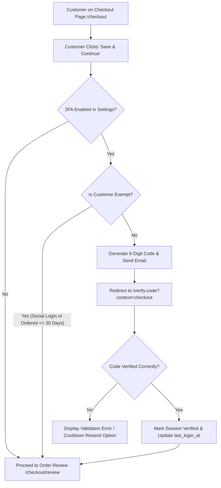
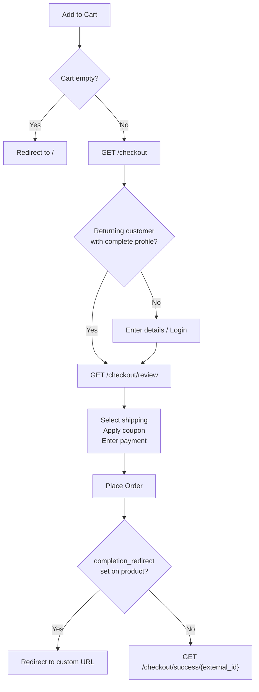

## Overview

Site Store Pro's checkout experience is split into three clearly separated stages: the **Cart** (item management), the **Checkout Details** page (customer info and address), and the **Checkout Review** page (payment, shipping, and tax). Each stage has server-side guards that prevent customers from reaching a later stage in an invalid state.

---

## Shopping Cart

**Route:** `GET /cart`

The cart is a **reactive, session-persisted** view of the customer's selected items. Quantities can be updated dynamically without a page reload, and the subtotal recalculates instantly.

### Session Persistence

Cart data is backed by:

- A **cookie-backed database log** — survives browser restarts and login state changes
- For authenticated customers, the cart is associated with their account so items persist across devices

### Slide-Out Cart Drawer

A **slide-out cart drawer** is available on every page of the storefront — customers don't need to navigate away to check their cart. The drawer shows:

- All cart items with thumbnails and variant descriptions
- Line-item subtotals
- Discounted prices with **strikethrough on the original price** where applicable
- A link to proceed to full cart or checkout

### Empty Cart Gating

Attempting to navigate to `/checkout` with an empty cart **redirects the customer to the homepage** (`/`) with a notice. This prevents a confusing empty checkout state.

### Mixed-Cart Blocking

<Warning>
  **Subscription variants and regular one-time purchase items cannot coexist in the same cart.**

  If a customer attempts to add a subscription product to a cart that already contains a standard item (or vice versa), the action is blocked and a **descriptive flash error message** is displayed explaining why the item cannot be added.

  Customers must either complete or clear their current cart before adding the conflicting item type.
</Warning>

---

## Checkout Flow

**Route:** `GET /checkout`

### Guest vs. Returning Customers

The checkout entry page handles both guest and authenticated customers:

| Customer Type | Behavior |
| --- | --- |
| **Guest** | Sees a details-entry form with inline options for traditional login or social OAuth login |
| **Returning customer (complete profile)** | **Automatically bypassed** to `/checkout/review` — no re-entry of known information |
| **Social OAuth account with empty profile** | Must complete shipping details before proceeding |

### Required Information

The fields required depend on the order contents:

<Tabs>
  <Tab title="Digital Orders">
    | Field | Required |
    | --- | --- |
    | Full name | ✅ |
    | Email address | ✅ |
    | Address / City / Zip / Country / State | ❌ |
  </Tab>
  <Tab title="Physical Orders">
    | Field | Required |
    | --- | --- |
    | Full name | ✅ |
    | Email address | ✅ |
    | Street address | ✅ |
    | City | ✅ |
    | ZIP / Postal code | ✅ |
    | Country | ✅ |
    | State / Province | ✅ (US and Canada) |
  </Tab>
</Tabs>

### Country & State Selectors

The country dropdown is sorted for convenience:

1. **United States** (pinned to top)
2. **Canada** (pinned second)
3. **United Kingdom** (pinned third)
4. All other countries in alphabetical order

State or province selection is **required** for US and Canadian customers. The state/province dropdown updates dynamically based on the selected country.

# Security & Checkout Authentication Documentation: 2FA & Guest Checkout Management


- **Two-Factor Authentication (2FA)** delivers automated, one-time 6-digit verification codes via email during checkout or login when risk conditions or inactivity thresholds are met.
- **Guest Checkout Enforcement** allows store administrators to disable anonymous purchases, ensuring every customer creates a password-protected account at checkout.
- **Intelligent Exemptions** ensure seamless friction-free experiences for OAuth social logins (Google, Facebook, GitHub) and active returning customers.

---

## Administrative Controls & Configuration

All security and checkout authentication toggles are managed through the administrative portal at:
```text
URL: /admin/settings
Tab: General / Store Settings (Two-Factor Authentication & Checkout Sections)
```

| Setting Name | Setting Key (`cms_settings`) | Default | Description |
|---|---|---|---|
| **Disable Guest Checkout (Force Account Creation)** | `disable_guest_checkout` | `0` (Off) | When enabled, unauthenticated customers cannot checkout without creating a password. Password and confirmation fields become mandatory. |
| **Enable 2FA Email Verification at Checkout** | `enable_checkout_2fa` | `0` (Off) | When enabled, non-exempt customers must verify a 6-digit email code before reaching the final order review and payment step. |
| **Enable 2FA Email Verification on Login** | `enable_login_2fa` | `0` (Off) | When enabled, non-exempt users (including staff and admins) who haven't logged in within the last 30 days must verify a 6-digit email code to access their account. |

---

## Two-Factor Authentication (2FA) System

### Checkout 2FA Verification Flow



1. **Trigger**: Fired when a customer submits their checkout details in `Checkout::saveDetailsAndContinue()` or when an authenticated customer with a complete profile bypasses Step 1 (`Checkout::canBypassCheckout()`).
2. **Challenge Creation**: The system generates a cryptographically secure 6-digit numeric code, records the timestamp, stores challenge state in session, and sends the template-driven verification email.
3. **Redirection**: Customer is redirected to `/verify-code?context=checkout`.
4. **Order Protection**: Direct URL navigation to `/checkout/review` is blocked by a guard in `OrderReview::mount()` until the 2FA challenge is verified.

---

### Login 2FA Verification Flow

1. **Trigger**: When a user submits credentials on `/login`.
2. **Credential Validation**: `LoginForm::authenticate()` verifies the email and password hash without establishing an authenticated session.
3. **Exemption Evaluation**: The system evaluates if the user has an active OAuth social link or has logged in within the past 30 days.
4. **Challenge Dispatch**: If 2FA is required, the session receives the challenge metadata, an email is dispatched, and the user is redirected to `/verify-code?context=login`.
5. **Completion**: Upon entering the correct 6-digit code, the user is authenticated via `Auth::login()`, their `last_login_at` timestamp is updated to `now()`, and they are routed to their designated dashboard.

---

### Exemption Rules & Logic

The system utilizes intelligent exemption rules implemented in [`app/Services/TwoFactorAuthService.php`]:

#### Exemption 1: Social Logins (OAuth)
- Customers and users registered or logging in via third-party providers (**Google**, **Facebook**, **GitHub**) have already completed external multi-factor verification with their identity provider.
- **Rule**: If `$user->provider` is present, the user is **100% exempt** from both checkout and login 2FA challenges.

#### Exemption 2: Active Returning Customers (Checkout)
- Customers who have placed an order in your store within the last **30 days** are recognized as trusted returning buyers.
- **Rule**: If the customer's account has an order where `order_date >= now()->subDays(30)`, checkout 2FA is bypassed.
- New customers or customers whose last order was > 30 days ago receive the verification code.

#### Exemption 3: Active Returning Users & Staff (Login)
- Users and administrators who have logged into the site within the last **30 days** bypass login 2FA.
- **Rule**: Evaluated against `users.last_login_at`. If `last_login_at >= now()->subDays(30)`, the user logs in directly.
- If `last_login_at` is `null` (first login) or older than 30 days, 2FA code entry is required.

---

### Verification Code Security & Expiry

- **Code Format**: 6-digit random numeric string (`100000` to `999999`).
- **Code Lifespan**: **15 minutes** (`CODE_EXPIRY_MINUTES = 15`). Expired codes are rejected with a clear error prompt to request a new code.
- **Resend Cooldown Protection**: **45 seconds** (`RESEND_COOLDOWN_SECONDS = 45`). Prevents email spam and rate-limit abuse.
- **Live UI Countdown**: The landing form displays an interactive JavaScript countdown timer (`Resend code in 42s`) using Alpine.js. The resend button is disabled until the cooldown reaches zero.

---

### 2FA Landing Form (`/verify-code`)

- **Route**: `GET /verify-code` (`name: auth.verify-code`)
- **Component**: [`app/Livewire/TwoFactorVerify.php`]
- **View**: [`resources/views/livewire/two-factor-verify.blade.php`]
- **UI Elements**:
  - Contextual heading: *"Verify Your Purchase"* (Checkout) vs. *"Two-Factor Verification"* (Login).
  - Target email display showing where the code was delivered.
  - Large tracking 6-digit numeric input with auto-focus and mobile numeric keypad support (`inputmode="numeric"`).
  - Dynamic loading spinners on submit and resend actions.
  - Return links: *"← Return to Checkout"* or *"← Back to Sign In"*.

---

### 2FA Email Template & Dynamic Tokens

- **Template Type ID**: `13` (Slug: `two_factor_verification`)
- **Manageable In**: `/admin/email-templates` and `/admin/languages/{id}/translations`
- **Supported Variables**:

| Variable Token | Description | Example Output |
|---|---|---|
| `{{verification_code}}` | The randomly generated 6-digit numeric verification code | `849201` |
| `{{customer_name}}` | Customer or user display name | `Jane Doe` |
| `{{expires_in_minutes}}` | Expiration window in minutes | `15` |
| `{{site_name}}` | The configured site store name | `Site Store Pro` |

---

## Disable Guest Checkout (Force Account Creation)

### Feature Behavior

When `disable_guest_checkout` is enabled in `/admin/settings`:

1. **Anonymous Checkout Removed**: All unauthenticated customers must provide a password to complete their purchase.
2. **Form Presentation**:
   - The password section header updates from *"Create a Password (Optional)"* to *"Create an Account Password \*"*.
   - Explanatory message displays: *"An account password is required to complete your order and track your purchases."*
   - Required indicators (`*`) are placed next to the Password and Confirm Password inputs.
3. **Seamless Account Provisioning**:
   - The customer account is created immediately with the hashed password.
   - The user is automatically authenticated upon completing Step 1.
   - All shopping cart items and historical data are linked to the newly created user ID.

---

### Validation & Password Requirements

When guest checkout is disabled and the customer is not logged in:
- **Field Rule**: `password` is validated as `'required|string|min:8|confirmed'`.
- **Confirmation Match**: `password_confirmation` must match `password`.
- **Minimum Length**: 8 characters.

---

### Account Creation vs. Guest Sentinel

| State | Guest Checkout Enabled (`0`) | Guest Checkout Disabled (`1`) |
|---|---|---|
| **No Password Provided** | User record created with plain-text sentinel `[GUEST-USER]`. System prompts user to set password later via `/account/set-password`. | **Blocked by Validation**. Customer cannot proceed without entering a password. |
| **Password Provided** | User record created with secure Bcrypt/Argon2 password hash. Account is fully registered. | User record created with secure Bcrypt/Argon2 password hash. Account is fully registered. |

---

## Role-Based Post-Login Redirection Behavior

When a user logs in (or completes 2FA verification):

1. **Customer Accounts (`role_id` = 1 [Customer], `role_id` = 2 [Wholesale])**:
   - If there are active items in their shopping cart: Redirected directly to **`/checkout`** to complete their order.
   - If the shopping cart is empty: Redirected to **`/dashboard`**.
2. **Administrative & Staff Accounts (`role_id` = 3 [Admin], `role_id` = 4 [Order Processor], `role_id` = 5 [Ticket Manager])**:
   - **Cart Override Bypassed**: Staff members are **never** redirected to checkout, even if items remain in their shopping cart.
   - Always redirected directly to **`/dashboard`**, which forwards them to their respective administrative workspaces (`/admin/dashboard` or `/admin/tickets`).

---

## Multi-Language & Translation Management

All user-facing strings across the 2FA system and Guest Checkout feature are 100% translatable via the Language Manager at `/admin/languages`:

---

## Technical Architecture & File Reference

### Models & Services
- [`app/Services/TwoFactorAuthService.php`] Core 2FA security service, code generator, session manager, and exemption evaluator.
- [`app/Models/User.php`]User model with `last_login_at` timestamp tracking and guest sentinel helper `isGuest()`.
- [`app/Services/EmailTemplateService.php`] Dispatches multilingual 2FA email notifications.

### Controllers & Livewire Components
- [`app/Livewire/AdminSettings.php`] Admin settings controller managing `disable_guest_checkout`, `enable_checkout_2fa`, and `enable_login_2fa`.
- [`app/Livewire/TwoFactorVerify.php`] 2FA verification landing form controller.
- [`app/Livewire/Checkout.php`] Checkout details form with dynamic password validation and 2FA challenge initiation.
- [`app/Livewire/OrderReview.php`] Final order review guarded against unverified 2FA challenges.
- [`app/Livewire/Forms/LoginForm.php`] Authentication form intercepting credentials for 2FA.
- [`app/Http/Controllers/Auth/SocialAuthController.php`] OAuth social login controller with role-based post-login redirection.

### Views & Templates
- [`resources/views/livewire/admin-settings.blade.php`] Admin settings UI toggles for 2FA and Guest Checkout.
- [`resources/views/livewire/two-factor-verify.blade.php`] 2FA verification form Blade view with Alpine.js countdown timer.
- [`resources/views/livewire/checkout.blade.php`] Checkout details Blade view with dynamic password fields and labels.
- [`resources/views/livewire/pages/auth/login.blade.php`] Sign-in form Blade view.

### Routing
- [`routes/web.php`](/routes/web.php) — Registers `GET /verify-code` (`auth.verify-code`).


### Order Comments

If the **Order Comments** feature is enabled globally (Admin → Settings), customers can include a free-text note with their order during checkout. This note is stored with the order and visible to the admin in the order management view.

---

## Checkout Review

**Route:** `GET /checkout/review`

The review page is the final pre-payment step. It loads all required payment, shipping, and tax information before the customer commits.

### Payment Processors

Site Store Pro supports three payment processors, loaded inline on the review page:

<CardGroup cols={3}>
  <Card title="Stripe" icon="stripe">
    **Stripe Elements** embedded inline — card details entered securely on-page
  </Card>

  <Card title="Paddle" icon="credit-card">
    **Paddle.js** overlay — handles VAT and global compliance automatically
  </Card>

  <Card title="PayPal" icon="paypal">
    **PayPal Smart Buttons** — customers can pay with PayPal balance, card, or Pay Later
  </Card>
</CardGroup>

### Shipping Options

All available shipping methods are displayed on the review page, sorted from **lowest to highest cost**:

- **Flat-rate** shipping rules (defined in Admin)
- **Carrier API rates** (real-time rates from integrated carriers)

Both sources are merged into a single sorted list. Customers select their preferred option before payment.

### Tax Calculation

Tax is calculated automatically based on the customer's shipping address:

| Region | Tax Type |
| --- | --- |
| United States | Sales Tax |
| Canada | GST / HST |
| Other countries | VAT |

<Note>
  **Selective Tax:** Only line items with `charge_tax = 1` are included in the taxable base. Products marked as tax-exempt are excluded from the calculation, even if the customer is in a taxable jurisdiction.
</Note>

### Coupon / Discount Codes

Customers can apply a coupon code on the review page. Coupon validation checks all of the following conditions:

| Validation Check | Description |
| --- | --- |
| Order minimum total | Coupon only valid if cart exceeds this amount |
| Order maximum total | Coupon only valid if cart is below this amount |
| Weight range | Coupon only valid within a shipment weight range |
| Quantity range | Coupon only valid for orders with a qualifying item count |
| Wholesale restriction | Some coupons are restricted to wholesale accounts only |

<Info>
  **Discount Order of Operations:** The coupon discount is deducted **before** tax and shipping are calculated. If the coupon grants free shipping, that benefit is also applied before final totals are shown.
</Info>

### Price Summary Display

The review page presents a clear breakdown:

```text
Subtotal:           $120.00
Discount (CODE10):  -$12.00
────────────────────────────
Taxable subtotal:   $108.00
Sales Tax (8.5%):    +$9.18
Shipping (UPS):     +$8.99
────────────────────────────
Order Total:        $126.17
```

---

## Checkout Success

**Route:** `GET /checkout/success/{external_id}`

After a successful payment, customers are sent to the order confirmation page. This page includes:

- A **formatted invoice** with all line items, pricing, and order reference number
- **Direct download links** for any digital products in the order (token-secured, subject to access limits)
- Estimated delivery information for physical items

### Post-Order Completion Redirect

<Note>
  Individual products can override the standard confirmation page behavior. If a product has a `completion_redirect` URL configured, customers who purchased that product are sent to that **custom URL** after checkout instead of the standard confirmation page.

  The redirect button label shown on the confirmation page is also configurable per product.
</Note>

---

## Checkout Flow Summary



---

## Quick Reference

<CardGroup cols={2}>
  <Card title="Cart Page" icon="cart-shopping">
    `GET /cart` — reactive item management, session-persisted
  </Card>

  <Card title="Checkout Details" icon="address-card">
    `GET /checkout` — guest/returning customer info entry
  </Card>

  <Card title="Checkout Review" icon="receipt">
    `GET /checkout/review` — payment, shipping, tax, and coupon
  </Card>

  <Card title="Order Confirmation" icon="circle-check">
    `GET /checkout/success/{external_id}` — invoice and digital downloads
  </Card>
</CardGroup>
